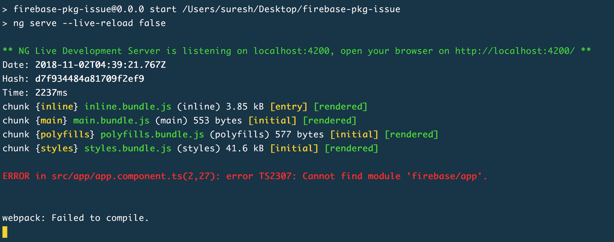

# firebase-pkg-typing-issue-in-angular-app

Demo application to reproduce the issue - https://github.com/firebase/firebase-js-sdk/issues/1342

## Dependencies
* Firebase SDK version: v5.5.6
* Firebase Product: app, messaging
* Angular version: v5.2.0

## How to start
* `git clone https://github.com/m-sureshraj/firebase-pkg-typing-issue-in-angular-app.git`
* `cd firebase-pkg-typing-issue-in-angular-app`
* run `npm install`
* run `npm start`
* you will see the following error message in the terminal 

